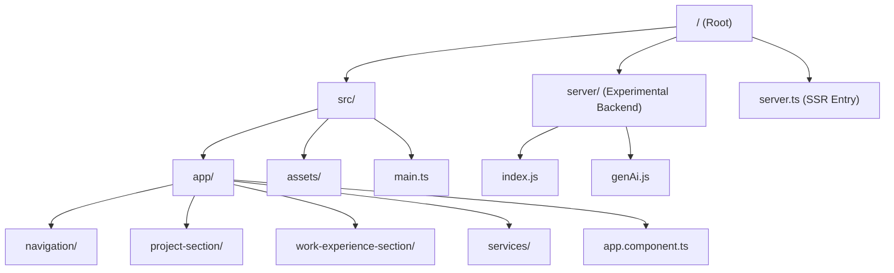
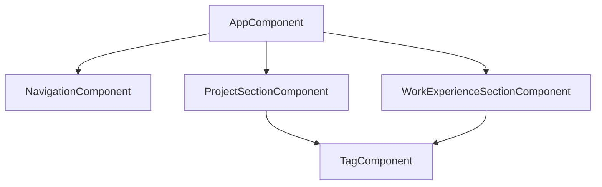

# AGENTS.md

## Project Overview
This repository contains a portfolio website built with **Angular 17**. It utilizes **Server-Side Rendering (SSR)** for better performance and SEO. Additionally, there is a separate experimental backend directory (`server/`) that is currently isolated from the main application.

## Deployment
The application is currently deployed on:
- **Render**
- **Vercel**

## Architecture

### Frontend (Angular 17)
- **Framework**: Angular 17
- **UI Library**: Angular Material
- **Structure**: Uses **Standalone Components** (bootstrapped via `bootstrapApplication` in `src/main.ts`).
- **SSR**: The application is configured for SSR using `@angular/ssr`. The entry point for the server is `server.ts`, which sets up an Express server to render the Angular app.

### Backend (Experimental)
- Located in the `server/` directory.
- **Status**: Isolated and not currently integrated with the main Angular app. This backend is intended for **upcoming AI features** that are not yet implemented.
- **Contents**:
    - `index.js`: A basic Express server (port 3000).
    - `genAi.js`: A script demonstrating Google Vertex AI integration (image analysis).
- **Note**: The main Angular app runs on port 4000 (SSR), while this experimental backend is configured for port 3000.

## Component Map (`src/app/`)
The main application logic resides in `src/app`. Key components include:

- **`navigation/`**: The navigation bar.
- **`project-section/`**: Displays the list of projects.
- **`work-experience-section/`**: Displays work history.
- **`tag/`**: A component for displaying tags (likely skills or categories).
- **`services/`**: Contains shared services, such as `screen-size.service.ts` for responsive handling.
- **`app.component.ts`**: The root component.

## Visualizations

### Directory Structure

### Component Hierarchy (Inferred)

## Directives for Agents
1.  **SSR Awareness**: When modifying the build process or server logic, remember that `server.ts` controls the SSR aspect of the Angular app.
2.  **Experimental Backend**: If asked to work on backend logic or AI features, check the `server/` directory. It is currently separate, so integration would require connecting the Angular frontend (e.g., via HttpClient) to this backend service.
3.  **Standalone Components**: This project uses Angular Standalone Components. Do not look for an `AppModule`. Import dependencies directly into the component's `imports` array.
